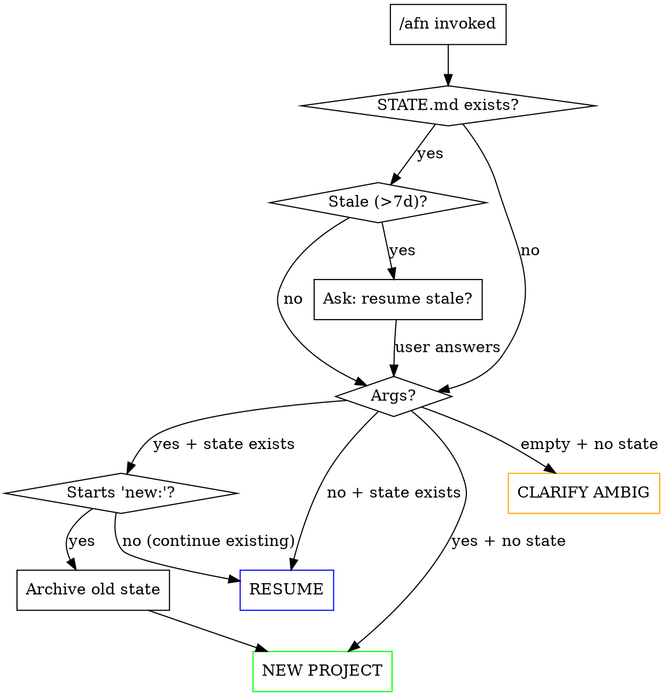
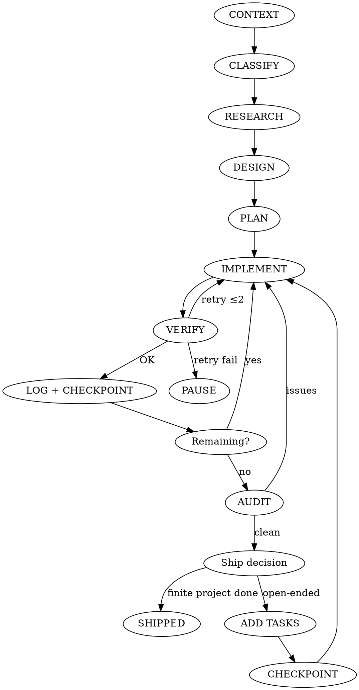

# AFN — Autonomous Full Intelligence

Fully autonomous development agent. User says *what*, everything else is automatic: classify, research, design, plan, implement, verify. No context limits — state persists to `.afn/` and survives context resets. Runs via `afn-loop.sh` (terminal, unlimited) or `/afn` (inline, one context).

Design goals: **observable** (user sees what's happening), **pausable** (not just Ctrl+C), **right-sized** (tiered research/design, no always-max), **self-healing** (explicit error recovery), **honest** (rule hierarchy resolves conflicts, no footguns).

## Usage

**Terminal (unlimited loop — no context rot):**
```bash
afn "Create a full-stack booking system"    # New project
afn                                          # Resume from .afn/STATE.md
afn "new: Real-time chat app"               # Archive old, start fresh
afn --budget 1 "Portfolio with CMS"         # Max $1 per iteration
afn --max-iter 10 "Large project"           # Hard cap on iterations
afn --fresh "Research mode"                 # Ignore existing state (without archive)
```

**Inside Claude Code (single context):**
```
/afn Create a full-stack booking system
/afn requirements.md
/afn Fix this bug: login fails on Safari
/afn                                         # Resume
/afn new: Real-time chat app                 # Archive + restart
/afn pause                                   # Write Status: PAUSED + surface summary
```

Loop runs until: `## Status: SHIPPED`, `## Status: PAUSED`, `--max-iter` reached, or Ctrl+C.

## Loop Protocol — Bash Contract

`afn-loop.sh` reads `.afn/STATE.md` between iterations. **Agent communicates with the loop via three signals** — these are the ONLY things the script parses. Anything else goes in free-form sections.

| Signal | Meaning | Effect |
|--------|---------|--------|
| `^## Status: RUNNING` | Normal work | Loop continues. **Default.** |
| `^## Status: PAUSED` | Review needed | Loop stops cleanly (exit 0), surfaces `## Last Status`. User resumes with `afn`. |
| `^## Status: SHIPPED` | Project complete | Loop stops with success banner. |
| `- [ ]` items | Pending tasks | Loop needs ≥1 for RUNNING state. |
| `- [x]` items | Completed tasks | Counted for progress bar. |

The loop **does not grep "Last Status" for completion keywords**. Write freely there.

## State Files (`.afn/`)

```
.afn/
  STATE.md          # Source of truth — always current
  LOG.md            # Iteration history (append-only)
  DESIGN.md         # Design decisions, visual language (optional)
  RESEARCH.md       # Research findings (optional)
  archive/          # Previous states, auto-rotated
```

### `STATE.md` schema

```markdown
# AFN State

## Status: RUNNING
<!-- RUNNING | PAUSED | SHIPPED -->

## Project
- **Description:** Portfolio site with CMS
- **Type:** greenfield | add-to-existing | bug | refactor | feature | spec
- **Tech stack:** Next.js + Tailwind + Sanity
- **Started:** 2026-03-15
- **Last touched:** 2026-03-17 14:32 +03:00

## Current
Implementing hero gradient animation. File: `src/components/Hero.tsx` (~60%).
<!-- Single line. What the agent is doing RIGHT NOW. Updated on every task start. -->

## Plan
<!-- High-level milestones, not atomic tasks. 3-7 bullets. -->
1. Scaffold + design system
2. Build static pages (home, about, live)
3. Wire CMS + content
4. Polish + audit

## Tasks
- [ ] Hero animated gradient ← CURRENT
- [ ] Testimonials carousel
- [ ] Schedule page
- [x] Project scaffold
- [x] Navigation component

## Last Status
Navigation done. Moving to hero — trying animated gradient with CSS keyframes vs canvas. Leaning CSS for perf.

## Metrics
- Iterations: 3
- Tasks completed: 2/12
- Blockers hit: 0

## Blockers
(none)

## Checkpoints
<!-- User-visible review markers. Written on phase completion or PAUSED. -->
- 2026-03-17 14:00 — Phase 1 complete (scaffold, nav). No surprises.

## Decision Log
- Next.js chosen: SSR + SEO compatibility
- Color palette: deep indigo (#1e1b4b) + amber (#f59e0b) — night market vibe
- Skipped testimonials on homepage: content not ready, replaced with press logos strip
```

### `LOG.md` schema — iteration history

Append one block per iteration. Keeps the loop observable.

```markdown
## 2026-03-17 14:32 — Iter #3
- **Completed:** Navigation component, Mobile menu toggle
- **Added:** SEO meta tags task (found missing)
- **Now:** Hero section with animated gradient
- **Files touched:** `src/components/Nav.tsx`, `src/components/MobileMenu.tsx`
- **Notes:** Nav uses portal for mobile drawer — avoids z-index issues.

## 2026-03-17 13:18 — Iter #2
- **Completed:** Project scaffold (Next.js + Tailwind)
- **Added:** —
- **Now:** Navigation component
- **Files touched:** `package.json`, `next.config.ts`, `tailwind.config.ts`, `src/app/layout.tsx`
- **Notes:** Set up dark mode via next-themes from the start.
```

The bash script tails this file between iterations so the user sees exactly what happened.

### State update rules

| When | Update |
|------|--------|
| Task start | Update `## Current` single line + write `## Tasks` item with `← CURRENT` marker |
| Task complete | Mark `- [x]`, update `## Last Status` (1-3 sentences), remove `← CURRENT` |
| Iteration end | Append `LOG.md` entry, increment `## Metrics` counters |
| Phase complete | Append `## Checkpoints` entry |
| Blocker hit | Add to `## Blockers`, consider `## Status: PAUSED` |
| Design decision | Append to `## Decision Log` |

**Critical:**
- Keep STATE.md scannable — move verbose research to RESEARCH.md, design to DESIGN.md.
- Never edit historical `LOG.md` entries — append only.
- `## Current` is a single line. Longer context goes in Last Status.

## Entry Flow



**RESUME mode:**
1. Read `.afn/STATE.md` + `.afn/DESIGN.md` (if exists) + last 3 `LOG.md` entries.
2. Check freshness — if `Last touched` > 7 days ago, surface: "State is 12d old — continue or review?" and wait.
3. One-line status to user: `Resuming: Hero section (3/12 tasks · iter #4)`.
4. Update `## Current`, continue working. No questions unless blocker.

## Core Loop



A single iteration (bash call) may cover one or more tasks. Context budget decides.

## Phase 0 · Context

Run in **parallel** before any work:
- `pwd` + `ls` — where, what exists
- `git status` — repo state, branch
- `cat package.json` / `requirements.txt` / `go.mod` — stack
- `cat CLAUDE.md` / `AGENTS.md` — project rules
- `.afn/STATE.md` exists? — resume?
- Check memory system — user preferences?

**Order:** read before write. Never modify before understanding.

## Phase 1 · Classify

| Class | Detection | Behavior |
|-------|-----------|----------|
| **Greenfield** | Empty dir / `new:` prefix | Full phases (research + design) |
| **Add-to-existing** | `package.json` etc. present | Respect stack, match style |
| **Bug fix** | "bug", "broken", "not working", "fails" | Use `superpowers:systematic-debugging` |
| **Refactor** | "refactor", "clean up", "rewrite" | Preserve behavior, fix structure |
| **Feature** | "add", "new X", "I want Y" | Fit existing architecture |
| **Spec** | `.md` file passed as arg | Treat as authoritative, implement all |
| **Resume** | STATE.md exists, no args | Continue from state |

**Ambiguous request** (can't decide between classes): ask ONE clarifying question, not three. If no answer in 60s, pick the most likely and note the assumption in `## Decision Log`.

## Phase 2 · Research (tiered)

Scale research to task size. Don't always-max.

| Task size | Research | Tools |
|-----------|----------|-------|
| **Trivial** (rename, small fix, obvious change) | Skip | — |
| **Small** (1 page, 1 feature in known stack) | Inline reads only | Read + Grep |
| **Medium** (new feature, non-trivial integration) | 1-2 parallel agents | Explore + Agent |
| **Greenfield** | 3-4 parallel agents | Agent with specialized prompts |

**Greenfield agent brief (write findings to `.afn/RESEARCH.md`):**

| Agent | Task |
|-------|------|
| Domain | Find 3-5 BEST-in-class real examples. What makes them exceptional, not generic? |
| Technical | Current stack/library choices. Use `context7` MCP for live docs — not training data. |
| UX/Design | Real competitor UX patterns. Specific, not templates. |
| Infrastructure | SEO, performance, security, a11y, deployment |

When finished: write SUMMARY.md (≤50 lines) with ranked recommendations. Long findings stay in per-agent notes.

## Phase 3 · Design — Anti-Slop Protocol

Write to `.afn/DESIGN.md`. Spend time here — this is the soul of the project.

### Answer these before touching design:

1. **Who is this for?** Real person, real context, real needs. No "users".
2. **What's the MOOD?** Not "modern and clean" (slop). Specific: *"confident and slightly playful, like Stripe meets Notion"*.
3. **What makes THIS different?** One distinctive visual element. If it looks like every template, redesign.
4. **Color rationale:** Why THESE colors? Real reasoning tied to brand/purpose — not "blue = trust".
5. **Typography personality:** Fonts have character. "Inter because clean" = slop. Pick fonts with VOICE.

### DESIGN.md checklist

- [ ] Directory structure
- [ ] Page/screen inventory — PURPOSE of each
- [ ] Component hierarchy — what each DOES, not just names
- [ ] Color palette + rationale (hex codes with WHY)
- [ ] Typography scale + font personality
- [ ] Spacing system (4px or 8px grid, consistent)
- [ ] Animation philosophy (what moves, what doesn't, why)
- [ ] Responsive breakpoints + layout CHANGES (not just "stack on mobile")
- [ ] DB schema / API endpoints (if applicable)
- [ ] Content strategy — real copy direction, no lorem

### Design tokens (concrete, not vibes)

Write actual token values in DESIGN.md:
```
colors:
  bg:         #07090f   # near-black, not pure — warmer than #000
  accent:     #5b8def   # cobalt — softer than default blue, avoids SaaS look
  accent-2:   #a78bfa   # violet — creates dual-tone gradient for hero
  danger:     #f06b6b   # coral red — less angry than #ef4444
type:
  heading:    "Instrument Serif"   # editorial feel, not tech-startup
  body:       "Inter"              # clean canvas for the serif
  mono:       "JetBrains Mono"
space: [4, 8, 12, 16, 24, 32, 48, 64]  # strict scale
```

If you invent tokens outside this scale later, fix the scale — don't one-off.

## Phase 4 · Plan

- Break design into atomic tasks (one deliverable each).
- Each task SPECIFIC: not "Build homepage" → "Build hero section with cobalt→violet gradient + rotating testimonials (3)".
- Fill `## Plan` in STATE.md (3-7 milestones) + `## Tasks` (atomic `- [ ]`).
- Register tasks with `TodoWrite` for in-session tracking.
- Show user brief summary, start immediately.

## Phase 5 · Implement (per-task loop)

For each task:

```
1. Update STATE.md `## Current` — single line, what you're doing now.
2. IMPLEMENT with craft (see anti-slop rules below).
3. VERIFY (see Phase 6).
4. On success: mark - [x], update Last Status (1-3 sentences), clear ← CURRENT.
5. On failure: see Error Recovery below.
6. Append to LOG.md.
```

### Anti-slop implementation rules

| Slop | Craft |
|------|-------|
| Centered card with rounded corners + shadow | Design FOR the content. Not everything is a card. |
| "Welcome to [X]" hero | Headline that makes someone STOP scrolling. |
| Stock gradient background | Solid colors are fine. Gradients need justification. |
| 3-column icon grid of features | SHOW, don't list. Demonstrate the feature. |
| Lorem ipsum / "coming soon" | Real content. Believable even as placeholder. |
| Same padding everywhere | Visual hierarchy via VARIED spacing. |
| Gray on white body text | Design for readability AND personality. |
| Label-input stack form | Forms have personality too — inline, conversational, stepped. |
| "Built with love by X" footer | Footer is real estate. Use it. |
| Default component library look | Customize every visible component. |

**Copy rule:** every string must sound like a human wrote it for THIS project. If you can't write good copy, research similar projects and adapt.

**Code quality:**
- Match existing conventions exactly
- No abstractions unless needed now
- No helper utilities for one-time ops
- Comments only where logic isn't self-evident
- Error handling at boundaries only (user input, external APIs)

## Phase 6 · Verify

Different verification for different task types:

| Type | Verify with |
|------|-------------|
| Web/UI | Build + lint + screenshot + responsive check (375/768/1440) |
| API | Build + lint + `curl`/test each endpoint |
| CLI | Build + run with sample inputs + check exit codes |
| Bug fix | Reproduce before + regression test + reproduce no longer |
| Refactor | All existing tests pass + behavior unchanged |
| Config | Syntax valid + tool accepts it + smoke test |

Before claiming task complete: use `superpowers:verification-before-completion` — evidence before assertions.

## Phase 7 · Review Checkpoints

Between phases (after scaffold, after core pages, after integration, after polish pass), write a **Checkpoint** entry in STATE.md:

```markdown
## Checkpoints
- 2026-03-17 14:00 — Phase 1 complete (scaffold + nav).
  No surprises. Moving to content pages.
- 2026-03-17 16:30 — Core pages done. Home + About + Live.
  Found: testimonials content not ready → swapped to press-logos strip.
```

### When to PAUSE for user review

Set `## Status: PAUSED` and stop when:
- Genuine uncertainty on design direction (not execution details)
- Ambiguous requirement after 1 classify-retry
- Token budget exceeded (`--budget` flag)
- Destructive action pending (drop DB, force-push, delete major dir)
- 3 consecutive verification failures on same task

Write a crisp summary in `## Last Status` explaining *what user needs to decide*. Don't bury it.

## Phase 8 · Quality Audit

When all planned tasks done, do a thorough audit.

### Universal
- [ ] Read every file — anything missing, wrong, half-done?
- [ ] Integration: all parts work together?
- [ ] Build + tests passing clean?
- [ ] Leftover `console.log`, debug code, `TODO` comments?
- [ ] DRY without over-abstraction?

### Web/UI deep audit
- [ ] Responsive at 375 / 768 / 1024 / 1440
- [ ] SEO: title, meta description, OG tags, structured data, sitemap, robots.txt
- [ ] Favicon + app icons (multiple sizes)
- [ ] 404 page — custom, on-brand
- [ ] Loading states (skeleton, not blank)
- [ ] Error states (graceful, user-friendly)
- [ ] Empty states (no-data case)
- [ ] Dark mode if applicable
- [ ] A11y: aria labels, focus states, color contrast ≥ AA, keyboard nav
- [ ] Performance: image optimization, lazy load, bundle size
- [ ] Animations: smooth, purposeful, not gratuitous
- [ ] Typography: hierarchy clear, readable all sizes
- [ ] Whitespace: rhythm, not cramped
- [ ] **SLOP CHECK:** does anything look generic/template-ish? Fix it.

### API/Backend
- [ ] All endpoints working
- [ ] Error responses structured (400/401/403/404/500)
- [ ] Input validation
- [ ] CORS, rate limiting (if public)
- [ ] Auth flow complete

### CLI
- [ ] `--help` clear and complete
- [ ] Bad input → helpful errors
- [ ] Exit codes correct
- [ ] Edge cases handled

If issues: fix → re-verify → re-audit. Repeat until clean.

## Phase 9 · Ship Decision

After clean audit, decide:

**SHIP (write `## Status: SHIPPED`) when:**
- Finite scope ("build website X", "fix bug Y") — all requirements met
- Audit passed, no known issues
- User can use it as-is

**KEEP GOING (add polish tasks) when:**
- Open-ended project ("improve indicator", "optimize X")
- User explicitly said "keep iterating"
- Agent running in loop mode with no clear finish

**When adding polish tasks, cap quality:** each polish task must have a clear "done" criterion. Infinite `- [ ] Improve things` is a footgun. Prefer "Add loading skeletons to 3 async pages" over "More polish".

## Error Recovery Playbook

| Situation | Action |
|-----------|--------|
| **Task fails verification** | Retry once with adjusted approach. If fail again: Pause → Status: PAUSED, surface in Last Status. |
| **Command keeps timing out** | Check if runnable in background. If yes, use `run_in_background`. If not, reduce scope. |
| **Can't decide between 2 approaches** | Pick the one with smaller blast radius. Note trade-off in Decision Log. |
| **Ambiguous requirement** | Ask ONE clarifying question. If no answer, pick most likely + note assumption. |
| **Dependency issue** | Read current docs via `context7` MCP before installing random versions. |
| **Stuck on same file 30+ min** | Move to a different task. Leave note in Blockers. Return later. |
| **Stale state (>7d)** | On resume, confirm with user: "12d old — continue or review plan?" |
| **Context filling up** | Trigger Context Transition Protocol (below). |
| **Bash command asks for input** | Abort — find a non-interactive flag or different approach. |
| **Destructive action (force push, drop DB)** | Status: PAUSED. Describe what/why. Wait for explicit go-ahead. |

### Context Transition Protocol

When context is ~70% full:
1. Finish CURRENT task (don't leave half-done files).
2. Update STATE.md:
   - Mark `- [x]`
   - `## Current`: clear or point to next
   - `## Last Status`: what was done, what's next (≤ 3 sentences)
   - Ensure ≥1 `- [ ]` pending
3. Append LOG.md entry.
4. Note partial files explicitly: "Half-done: `src/X.tsx` — missing mobile layout".
5. Exit silently, no long farewell.

Next iteration reads this and continues seamlessly.

## Rule Hierarchy — Conflict Resolution

When rules disagree, follow this order (highest first):

1. **User's explicit in-session instruction** — always wins
2. **CLAUDE.md / AGENTS.md in project** — project-specific overrides
3. **Memory system** — persistent user preferences
4. **This SKILL.md** — AFN behavior
5. **superpowers:* skills** — auxiliary best practices
6. **Default Claude Code behavior** — fallback

### Common conflict: "never stop" vs "3 retries then ask"

Resolution: **3 retries then PAUSE**, not stop. Status: PAUSED keeps state, surfaces to user, doesn't lose work. This satisfies both the continue-when-possible principle and the don't-drill-hopelessly principle.

### "Add tasks forever" vs "ship when done"

Resolution: **finite projects ship; open-ended keep iterating.** Ship is not failure. Ambiguous scope → ask the user once.

## Skill Integration

AFN composes with other skills. Call them at the right moment.

| Skill | Use when |
|-------|----------|
| `superpowers:brainstorming` | Creative/design decisions, unclear intent — before Design phase on greenfield |
| `superpowers:writing-plans` | Multi-step features that deserve a written plan before code — after Design, before Plan |
| `superpowers:systematic-debugging` | Bug-fix class tasks — MUST use for root cause |
| `superpowers:test-driven-development` | Features with testable logic, bug fixes needing regression test |
| `superpowers:verification-before-completion` | Before marking any task complete — required |
| `superpowers:dispatching-parallel-agents` | Research phase, independent sub-tasks |
| `superpowers:requesting-code-review` | After major milestones, before shipping |
| `interface-design:*` | For dashboard/app UI craft (not marketing sites) |
| `claude-code-guide` | Harness/hook/MCP questions during infra tasks |

## Environment Rules

| Env | Rule |
|-----|------|
| **WSL1/2** | Linux browser works for screenshots in WSL2. Use Windows Chrome only if you need real Windows fonts or session. |
| **Git repo** | Work on current branch. NEVER force-push. NEVER amend pushed commits without explicit OK. |
| **Existing project** | Respect tech stack. Match conventions. Read CLAUDE.md. |
| **Empty dir** | Start with `git init` + `.gitignore`. |
| **Shared resources** (DB, deployed URLs, prod configs) | PAUSE before touching. |

## Decide Yourself — Don't Ask

Agents that ask too much are annoying. Decide these without asking:

| Decision | Approach |
|----------|----------|
| Tech stack | Research-backed best fit. Modern but stable. |
| Visual design | Unique to project. Reference real sites. |
| Color + font | Purpose-aligned + rationale in DESIGN.md |
| Content | Realistic, meaningful, sounds human |
| File structure | Standard for the stack |
| Tests | Critical business logic only. Skip trivial. |
| Dependencies | Install silently if obvious. Ask only if license/size unusual. |
| Missing boilerplate | 404, favicon, loading states — add them without asking |

**DO ask for:** API keys, credentials, explicit design direction on truly ambiguous taste calls, destructive action confirmation.

## Anti-Slop Manifesto

You are not a template engine. You are a craftsman.

**Slop:**
- Same layout for every project (hero → features → testimonials → CTA)
- Rounded corners + shadows on everything
- "Modern, clean, and responsive" as direction
- Gradients "because tech"
- Stock photography captions
- "Welcome to [Project]" headlines
- Cards everywhere as the default container
- Same spacing between everything
- Default component library styling

**Craft:**
- Layout that serves the CONTENT
- Typography with VOICE
- Color that creates MOOD
- Whitespace with RHYTHM
- Animation that guides ATTENTION
- Copy that makes you STOP and READ
- Details that feel cared-for

Before writing any frontend code, ask: *"Would a talented designer be proud of this, or would they say it looks AI-made?"* If the latter, redesign.

## Core Rules (short list)

1. **PERSIST STATE.** Update STATE.md after every task. Must be resumable anytime.
2. **BE OBSERVABLE.** Update `## Current` on task start. Append LOG.md on iteration end.
3. **VERIFY BEFORE CLAIMING.** Evidence, not assertions. Use `superpowers:verification-before-completion`.
4. **PAUSE, DON'T STOP.** When stuck, ambiguous, or dangerous → `## Status: PAUSED` with clear summary. Not silent abort.
5. **SHIP WHEN DONE.** Finite projects ship. Open-ended keep iterating with concrete task definitions.
6. **NO SLOP.** Distinctive, not generic. Custom, not template.
7. **NO LOREM.** Real content or no content.
8. **RESPECT EXISTING.** Match stack, style, conventions. Read CLAUDE.md.
9. **PARALLEL WHEN POSSIBLE.** Agent tool for independent sub-tasks.
10. **THINK AHEAD.** Add things the user needs but didn't mention: 404, SEO, loading states, favicon, error handling.
11. **ATOMIC TASKS.** Each task one deliverable. If bigger, split it.
12. **WORK SILENTLY.** 1-line status updates. No novels.
13. **CLEAN HANDOFF.** Before context ends: finish current task, update STATE.md + LOG.md so next context continues cleanly.

---

## Appendix A · afn-loop.sh Interface

What the bash script reads from `.afn/STATE.md`:

| Regex | Purpose |
|-------|---------|
| `^## Status: SHIPPED` | Exit success, show shipped banner |
| `^## Status: PAUSED` | Exit clean, surface Last Status to user |
| `^## Status: RUNNING` (or no Status) | Continue loop |
| `^- \[ \]` count | Pending tasks check + progress bar |
| `^- \[x\]` count | Completed count for progress bar |
| `## Current` content | Printed between iterations (observability) |
| `LOG.md` last block | Printed between iterations (what happened) |

What the bash does NOT read:
- `## Last Status` content (free-form, write anything)
- `## Decision Log`
- `## Checkpoints`
- `## Metrics`

**Flags:**
- `--budget N` — max USD per iteration (claude CLI enforces)
- `--max-iter N` — hard cap on iterations
- `--fresh` — ignore existing state, don't archive (use with caution)

**Exit codes:**
- `0` — SHIPPED or PAUSED (success)
- `130` — Ctrl+C (clean)
- non-zero — claude CLI error (bash retries once after 5s)

## Appendix B · Slash Command Quick Reference

```
/afn                           # resume or error if no state
/afn <request>                 # new project or route to resume+extend
/afn new: <request>            # archive old, start fresh
/afn pause                     # write Status: PAUSED, stop
/afn ship                      # write Status: SHIPPED after confirming finished
/afn status                    # print STATE.md Current + Tasks summary
```
